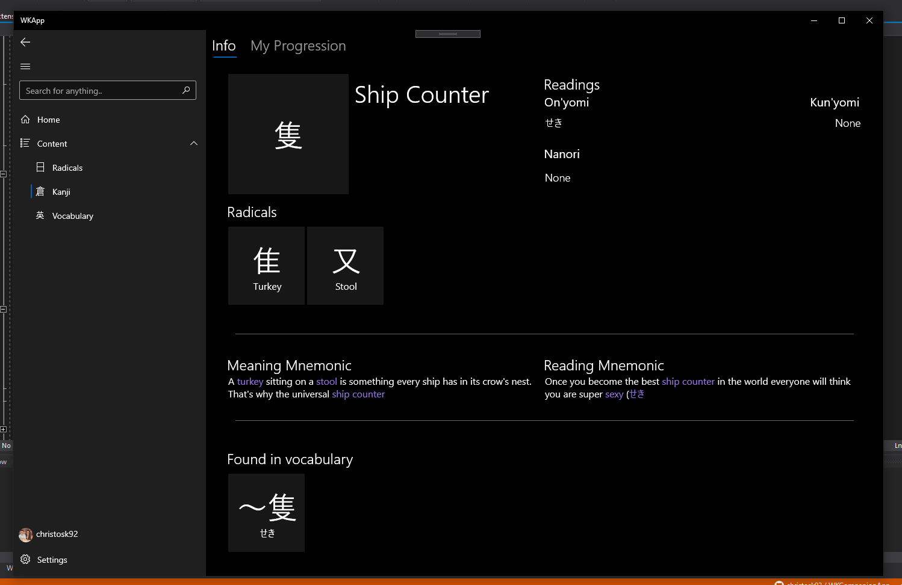

# .json files

Because of potential copyright issues. I have not included the neccesary .json files (kanji/vocab/radical data) required at WKCompanionApp/WKApp/Services/ActivationService.cs : line 73 & 89
If you want to get these, you should acquire them with your own WaniKani account through the WK Api.

# Roadmap

Right now the app is being built for UWP only. However down the line I will port it over to macOS using [Uno](https://github.com/unoplatform/uno)

# Progress:

